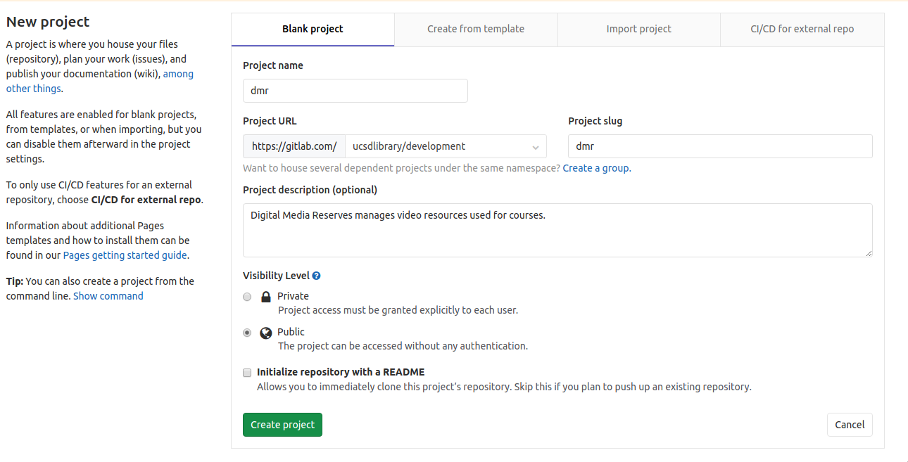
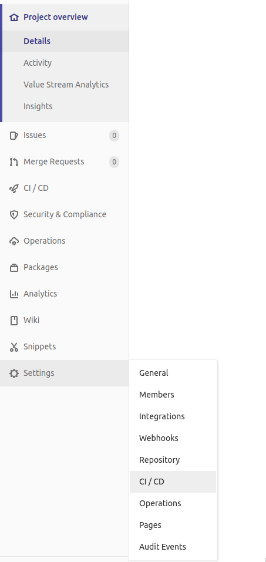
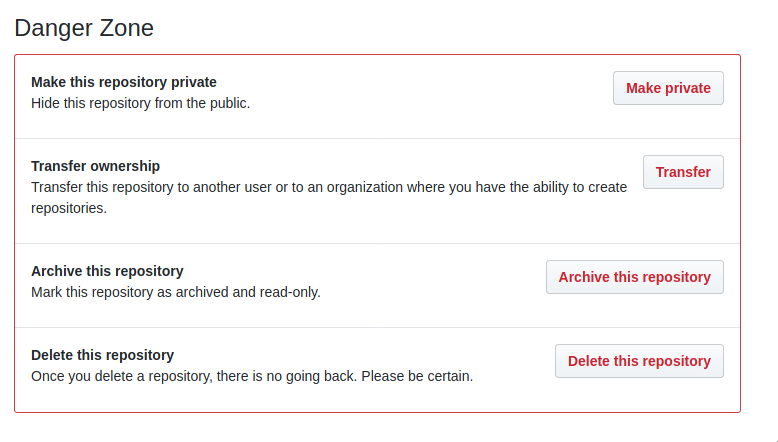

# GitHub to GitLab Repository Migration #

The following is a checklist for migrating an application from our GitHub
organization to GitLab.

## Create GitLab Repository
1. Clone the GitHub repository you intend to migrate
1. Navigate to the [UCSD GitLab Development sub-project][gitlab-dev]
1. Authenticate with your UCSD Credentials using `Google`
1. Click `New Project`
1. Add `Project Name`, `Project Description` to match GitHub repository
1. Set the `Visibility Level` to match the GitHub repository (generally, `Public`)
1. Do **NOT** initialize with a `LICENSE` or `README`
1. Click `Create Project`



## Push Repository to GitLab
1. Follow the steps outlined in the `Push an existing Git repository` section:
```
git remote rename origin old-origin
git remote add origin git@gitlab.com:ucsdlibrary/development/dmr.git
git push -u origin --all
git push -u origin --tags
```

Refresh the browser page to confirm the repository is populated on GitLab

## Configure Core Project Settings

### Get SSH key setup for Deployment (Optional)
> NOTE: Optional in some cases, such as deploying via Tomcat Manager over http(s)

In order to deploy applications via SSH, a keypair will need to be generated and
the private key added as a CI/CD environment variable. Work with Operations to
obtain this key and ensure the keys are setup on the hosts that need to be
deployed to.

> NOTE: we only are doing this because we're running all GitLab runners in our
local infrastructure, which we trust to deploy.

Go to Settings -> CI/CD:



1. Click `Expand` on the `Variables` section, and create a variable named
   `SSH_PRIVATE_KEY` with the value of the key pasted in.
1. Toggle the `Protected` radio button, ensuring this variable is only
   accessible in protected branches/tags/environments. Note: `master` should be
   setup as a [protected branch][gitlab-protected-branches].
1. Click `Save Variables`

### Merge Requests
1. Navigate to Settings -> General
1. Toggle `Merge Requests`
1. Choose `Fast-forward merge`

### CI/CD Runners
1. Navigate to Settings -> CI/CD
1. Toggle `Runners`
1. In the `Shared Runners` section, click `Disable shared Runners`
1. In the `Group Runners` section, enable the group shared Runner listed. This
   is our local set of GitLab Runners running in our own infrastructure.

### Slack Integration (ChatOps, etc.)
1. Navigate to Settings -> Integrations
1. Scroll down and click `Slack Application`
1. Follow the steps to active the integration for your application
1. Now, if you have any `chatops` jobs setup in your GitLab CI file, you (or
   Operations) will be able to deploy in Slack:

Examples:
```
/gitlab ucsdlibrary/apbatch run staging_deploy
/gitlab ucsdlibrary/dmr run pontos_deploy
```

## Create .gitlab-ci.yml
Now we need to setup CI/CD for the project. There are a few scenarios outlined
below. Find the one that matches the project you're migrating.

In general, if there is an existing `CircleCI` or `Jenkins` build, test, and
deploy configuration, you're going to want to emulate that in GitLab's CI
system.

You also will likely want to just get the `build` and/or `test` stages passing first. Then, move on to the `deploy` stage last. This can then be proposed as a single Merge Request, or you can split it up into two if you would prefer.

### Ruby Application Deployed via Capistrano
1. Copy the [Ruby GitLab template][gitlab-ruby] into your project, renaming it
   to `.gitlab-ci.yml`
1. Update the template to match the needs of the project.

### Java Application Deployed via Tomcat Manager
1. Copy the [Java Tomcat Manager GitLab template][gitlab-java-tomcat] into your project, renaming it
   to `.gitlab-ci.yml`
1. Update the template to match the needs of the project.
1. Add sensitive [environment variables][gitlab-env-vars] such as `TOMCAT_MANAGER_STAGING_PASSWORD` and others as needed to the GitLab project.

### Java Application Deployed via SSH
> If this project **CAN** use Tomcat Manager, it would be preferrable to do that, as you can avoid direct SSH commands

1. Copy the [Java Tomcat Manager GitLab template][gitlab-java-tomcat] into your project, renaming it
   to `.gitlab-ci.yml`
1. Update the template to use direct SSH commands, mirroring the existing
   Jenkins set of commands. This would also include post-deploy commands such as
   restarting tomcat.

## Remove GitHub/CI Context
The goal here is to remove any content in the repository that is specific to
GitHub and any existing CI tools such as `CircleCI`, `Hound`, etc.

1. Create a new branch off `master` in the GitLab repo
1. Remove files such as: `.circleci/*` and `.github/*`
1. Create a `Merge Request` to make these changes and ping someone on the
   Development team for a review

## Archive GitHub Repository

### Pre-Archive Checklist
1. All branches and tags have successfully migrated to GitLab for this
   repository
1. Merge Requests trigger appropriate `build`, `test`, pipelines
1. Deploying via GitLab functions properly in **ALL** environments

### Archive the GitHub Repository
1. Navigate to the GitHub repository and ensure you are logged in
1. Go to Settings
1. Scroll to the bottom `Danger Zone` section
1. Select `Archive this repository`



[gitlab-dev]:https://gitlab.com/ucsdlibrary/development
[gitlab-env-vars]:https://docs.gitlab.com/ee/ci/variables/
[gitlab-java-tomcat]:./templates/.gitlab-ci-java-tomcat.yml
[gitlab-protected-branches]:https://gitlab.com/help/user/project/protected_branches.md
[gitlab-ruby]:./templates/.gitlab-ci-ruby.yml
